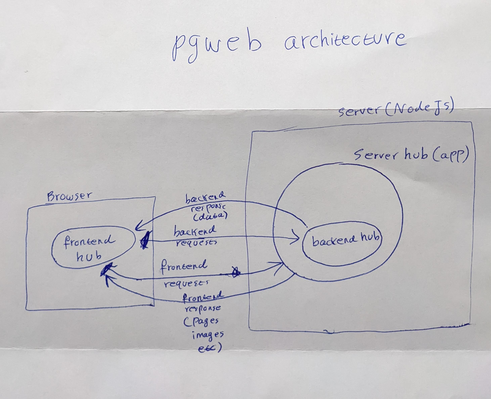

Pgweb is a framework to build full-stack web apps (backend + frontend) using Pinglue system.

To understand this framework you need to have knowledge about [Pinglue system](:pg-overview). It is recommended to have completed the  as a minimum before attempting to read this document. 

Pgweb is an opinionated framework. It should be considered as *a way* to build web apps using Pinglue. There could be definitely different ways as well, and pgweb framework should not be used to define Pinglue. Pinglue is a neutral system to build any type of app; Pinglue only provides a way to glue packages together and the rest is up to the software architect. Pgweb is an example of how to use Pinglue system in a web server-client scenario. 

In pgweb framework there are three main hubs:

1. frontend hub (from route `./frontend`), which lives in the client browser
2. backend hub (from route `/backend`), which is responsible for processing frontend API request and communicating with server resources, most notably a MondoDB database.
3. server hub (from the route `./server`), which creates a server (expressJS based server) to serve the frontend pages and redirecting backend requests to the backend hub.

A high level architecture of pgweb framework could look like this:

Pgweb framework is frontend agnostic, meaning it works with any javascript-based frontend framework: ReactJs, NextJs, Angular2, Vue, custom html+webpack toolchain and even React native! (though not a web framework technically). Whatever frontend tool or framework you use, all that is needed to do is to run channels on the pgweb frontend hub to get things done.

One interesting (and innovative) fact about pgweb is: each frontend controller (within the frontend hub) only communicates with the controller in the backend hub from the *same* plugin. And this communication is also facilitated by means a simple RPC call. That means: in pgweb we *don't have backend API* (either in the form of REST or GraphQL), it is an APIless architecture. Each plugin manages communication between its frontend and backend controllers and there is no real distinction between the frontend world and backend world. 

Another innovative concept in pgweb is *PIN*: Point of Interaction Node. PIN is simply a UI component (could be any component, like React component, Angular component, Web component) which contains a Pinglue controller within itself. This controller is connected to the frontend hub, and through this controller the component is able to communicate with all frontend controllers. A PIN is in fact the pgweb frontend hub point of contact with the user. Its role is to translate and route user interactions into the Pinglue (frontend) hub, and that is why it is called Point of interaction node. 

Pin is meant to be light on logic. Its main purpose is to route user interactions into the Pinglue system. The heavy and complicated logic should be carried out by frontend controllers. For example when user clicks on the logout button, the PIN whose component is controlling that button simply runs the channel `logout`, now the main login of logout action and communication with the backend (which could be complex task in some cases) is handled by the dedicated controller from the login plugin. Pins are merely medium between user and Pinglue hub. 

The best place to learn about pgweb framework is the  which is offered in several different frontend frameworks.  