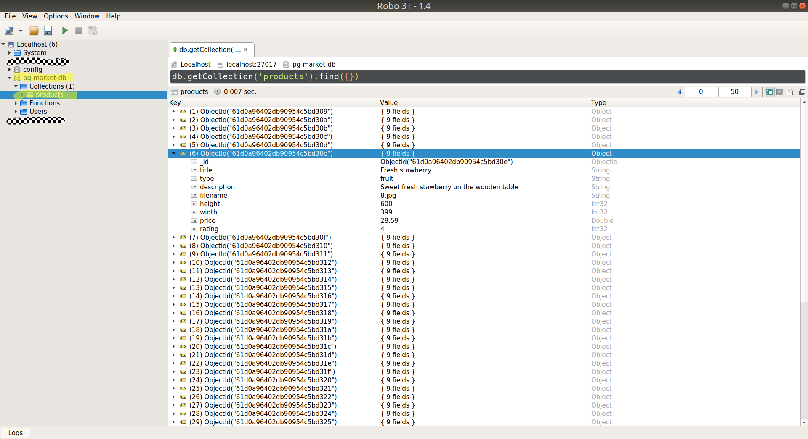

Lets import the products for the PG Market into our database.

Make sure the MongoDB server is running:

```shell
sudo service mongod status
```

If it is not running, start it:

```shell
sudo service mongod start
```

Then:

### Step 1:
Download the sample products in json format from [here](files/sample-products.json). 

### Step 2:
Push these products into a new database `pg-market-db` and collection `products`:

```
mongoimport -d pg-market-db -c products --jsonArray sample-products.json
```

Now you should see the new database and collection in your MongoDB server:


*Note: in this screenshot we used Robo 3T program to display the MongoDB content graphically - you may use any other tool or just use the CLI*

