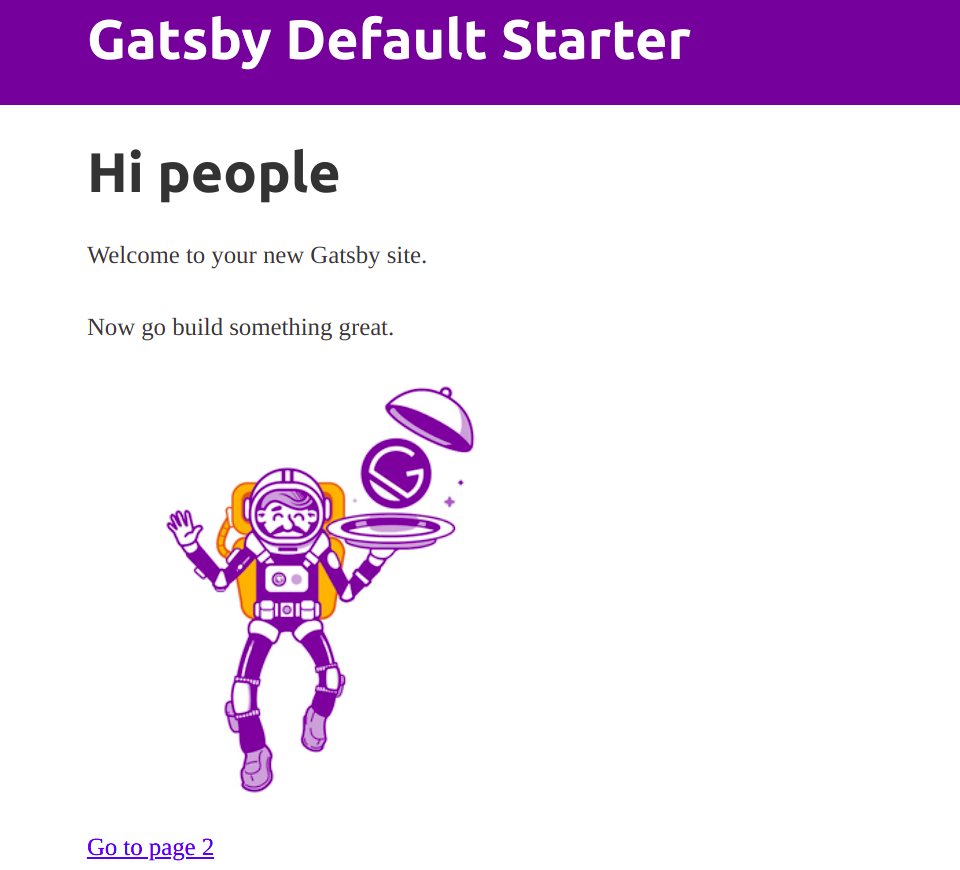

Normally you can use any folder for your pgweb app. But since we are still in the pre-release stage and using the monorepo directly, so we are going to make our PG Market project at `packages/@pg-market/main` within the Monorepo.

For this project we use [GatsbyJS](https://www.gatsbyjs.com/), and Gatsby CLI creates the project folder among other things. So we don't need to create this folder manually and initialize it with NPM, instead:

### Step 1:

Navigate to the monorepo *packages* folder and create a new Gatsby project:

*from packages folder:*
```
mkdir @pg-market
cd @pg-market
gatsby new main
```

<Note>It might take quite a while for GastbyJS to create a project!</Note>

To test that it works, go to the main folder and run the dev server:

```
cd main
gatsby develop
```

Now you should see some default page on your browser at `http://localhost:8000/`


*Note: The exact appearance of this page might be different as new versions of GatsbyJS come along*

<Recall>The new folder *@pg-market* you just created won't be part of the monorepo git. You need to push this folder into a new Git repo if you want to use git as its source control.</Recall>

### Step 2

Give a more meaningful name to the pg-market project. In the package.json in the project root change the name to `@pg-market/main`.

### Step 3 (Optional but recommended)

As stated elsewhere, support for NodeJS monorepos are little at this point among different JS tools and frameworks. For example when we created a GatsbyJS project in the previous step, Gatsby also downloaded all the dependencies modules directly into the `node_modules` folder of the project (and to mention that almost all other tools/frameworks in Javascript ecosystem do the same thing when creating a new project). Nice as this automation is, it is NOT very compatible with monorepo settings. In a monorepo settings (whether using Lerna or other tools), the act of downloading dependencies modules into node_module folders for the packages (a process also known as *bootstrapping the repo*) should be done by the centralized mono repo management system (rather than individually by each package). This is because some packages in the monorepo might be local and thus do not need to be downloaded from any online registry, and only the monorepo management tool (Lerna for example) knows which packages are local and which are remote. 

By the above explanation, we can feel that the `node_module` folder created and populated by GatsbyJS in the previous step might be potentially dangerous for out monorepo setting (event though it is ok to leave it this way for this tutorial). So. to make things more align with monorepo rules:

1. (First stop the dev server if it's still running by pressing Ctrl+C)
2. Delete the `node_modules` folder in the PG Market project folder (`@projects/pg-market`)
3. bootstrap the monorepo using Lerna by running the following command from the monorepo root:

```
npm run bt
```

Run the dev server again and make sure you can see the starter page.

> **If you get weird errors ...** Beware that at the time of writing this tutorial the current version of Gatsby (4.4.0) gives weird errors when you follow the above process: it cannot resolve a bunch of packages (does it mean that `gatsby new` installs some packages not stated in the package.json as dependencies? we never know!). If that happens just change the gatsby version in the project package.json to `^3.13.1`, and then repeat the above process.

> *Note:* The above process in this step actually creates no difference: the new node_modules folder contains (and should contain) the same packages as the delete one. But note that Lerna bootstraps the repo after adding a package to another package in the repo. So by doing the process in this step we make sure that Lerna's bootstrap process will not break our Gatsby project. 
