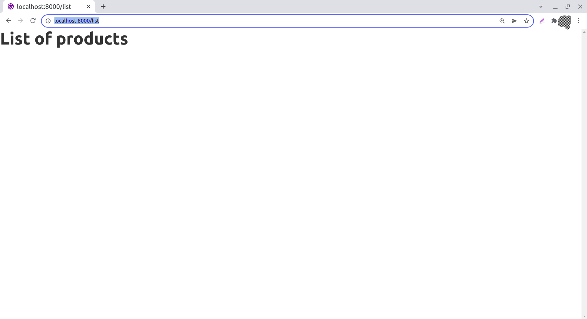

The first page is going to show the list of products (saved into the products collection)

To do so, we need to add the page to the folder `src/pages` in our Gatsby project. Before doing so, you may safely delete other pages at *src/pages* (but you may keep `404.js`)

You can use either Javascript or Typescript. In this tutorial we stick with Javascript.

So lets create a new file `list.js` at `src/pages` which shows just a header:

*src/pages/list.js*
```jsx
import * as React from "react";

export default function() {

    return (
        <h1> List of products</h1> 
    );

}
```

Run Gatsby dev server. You should be able to access the page at `http://localhost:8000/list`



That's good for now. Next we are going to add Pinglue packages to the project and then using them we will complete this page to show the list pf products. read on.

<Info>You can see the code for this step at [this commit](https://github.com/pinglue/samples-pgweb/commit/34b0052a3a60987b99ebcf11b7e06bfd817ca102)</Info>