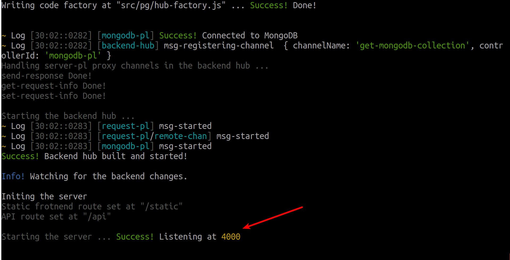
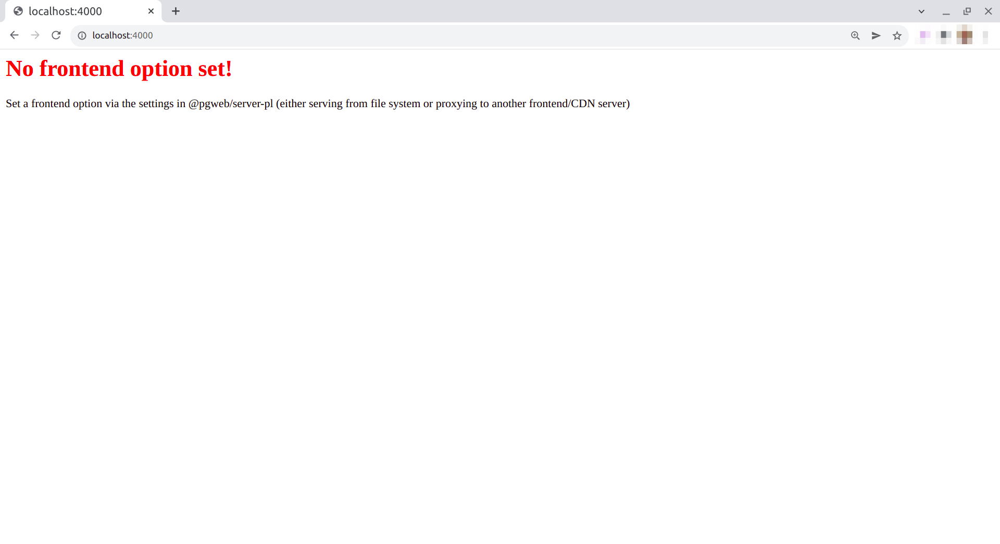
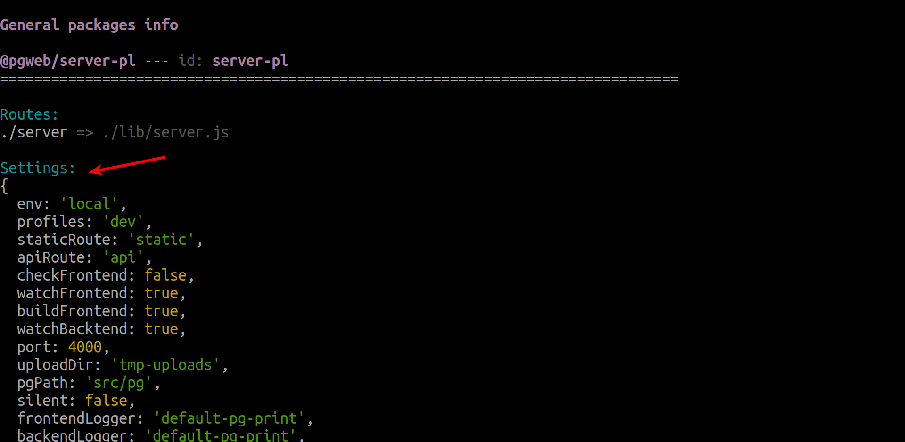
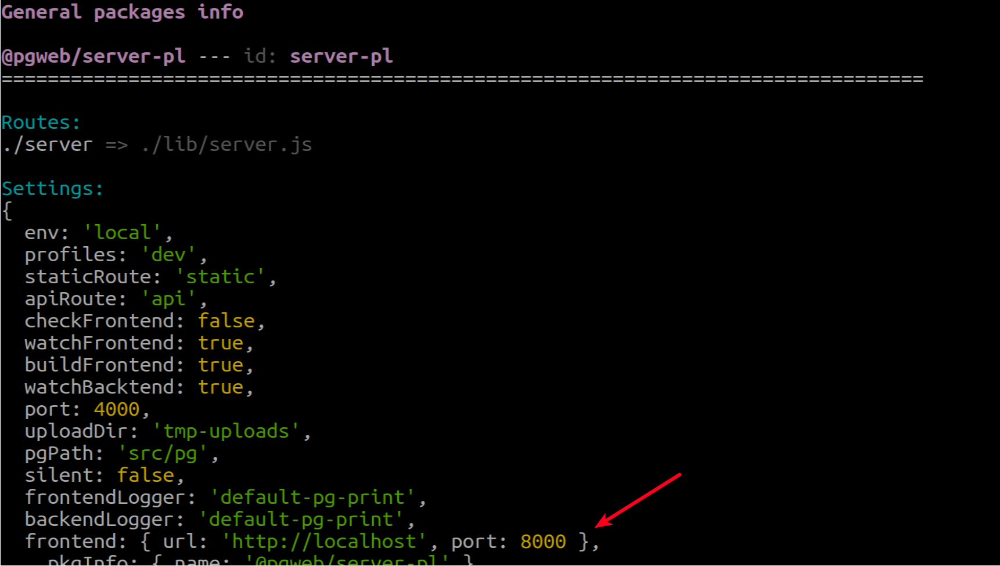
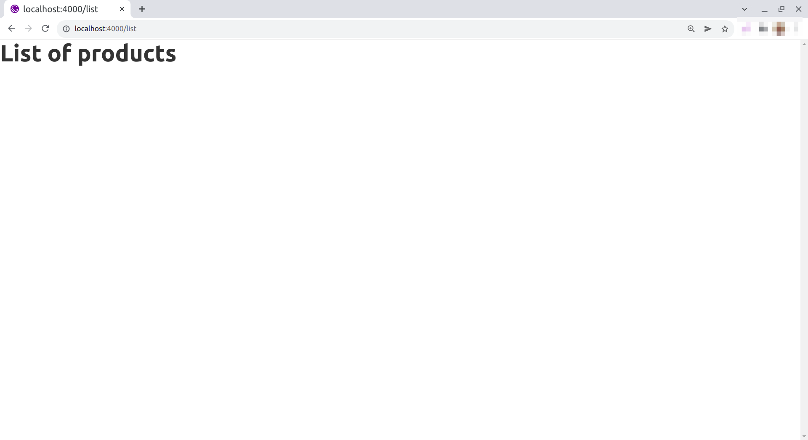
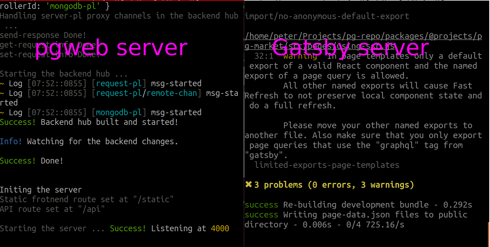

The Pinglue route `/server` in a pgweb app creates the so-called pgweb server, which is a server that serves both the backend (pinglue route `/backend`) and the frontend (either from a local or a remote location). So to start the pgweb server just run the route `/server` using the pg CLI:

*from pg-market project root*
```bash
npx pg run server
```

This command produces tons of logs (as two hubs `/backend` and `/server` are being bootstrapped and the server is starting). If no error happens, at the end you should see the message stating that the server is now listening at local port 4000



Then try to access the address `localhost:4000` from your browser. You should see an error page:




### What the error means?

This is expected, because we haven't told the pgweb server that the frontend is served by GatsbyJS from the address `localhost:8000`. In fact at the moment no option for the frontend is set in the pgweb server (as stated by the error message on the page). 

Frontend option is set withing the settings of the `@pgweb/server-pl` plugin. This plugin exports the runner controller for the route `/server` 

<Recall> *runner controller* is the one that determines the main course of action for a route, kind of like skeleton for that route, and other plugins merely enhance or modify the actions done by the runner through channels <Recall>

Lets learn more about the settings of the plugin `@pgweb/server-pl`. If you recall, the schema for the settings of any plugin in Pinglue system is found in the `pg.yaml` file located at the root of the package. So opening the file `pg-repo/packages/@pgweb/server-pl/pg.yaml`, under `settings:` you should see these lines:

```yaml

id: server-pl

settings:

  type: object

  properties:
    ...
    frontend:
      type: object
      properties:
        filePath:
          type: string          
        url:
          type: string          
        port:
          type: number

    ...

```

The field `frontend` in the settings (defined above) tells the pgweb server where to look for the frontend. If the url and optionally the port fields are set, then pgweb will proxy the frontend requests to the remote address `url:port`. If url field is not set but filePath field is set then pgweb server serves the frontend request with files from the folder indicated by the filePath field relative to the project root (static serving). So we can set the pgweb to serve the frontend either remotely or locally from files. In our case, since we are using Gatsby dev server we need to use the first option (proxy to the address `localhost:8000`). 

> **Note:** For production mode we will no longer use Gatsby dev server, but instead build the html files into the `public` folder. In that case we will need to set the pgweb server to serve the frontend from this folder. We will cover this topic later.

### How to change `@pgweb/server-pl` settings 

So to set the frontend address as `localhost:8000` we need to change `@pgweb/server-pl` settings for our project. In general there are several ways to change a plugin settings. The easiest way is to directly change the plugin settings in the folder `data`. According to the Pinglue architecture, all plugins' info for a project, including their settings, are saved into the folder `data` located in the project root. The folder structure in `data` folder follows the same pattern as the npm package name. So for example, the info for the plugin `@pgweb/server-pl` is located in the folder `data/@pgweb/server-pl`. The settings for this plugin is saved into the file `settings.yaml` within this folder. So the location to the plugin's settings will be `data/@pgweb/server-pl/settings.yaml` (relative to the project root). If this location does not exist you can create it manually (and of course in it should not exist for we haven't changed any settings for this plugin)

<Recall> The settings in the data folder overwrite the default values specified in the settings's schema (at the package's pg.yaml file) </Recall>

### Displaying the settings

Before we create `settings.yaml` for this plugin, lets learn a few CLI tricks. We can use `pg info` to see the settings of any/all plugin(s):

*from project main folder:*
```bash
npx pg info -k @pgweb/server-pl
```

It shows several info for the package `@pgweb/server-pl`, including its current settings:




<Tip> The option `-k` filters the plugins by name. Without this option the cli will show the info for all installed Pinglue packages. </Tip>

Note that at the moment we did not add any settings to any package in the project (in fact the folder `data` at the project does not even exist). So the settings that we see above for `@pgweb/server-pl` is purely calculated by default settings values defined in its json settings schema (at `pg.yaml`). As you can see, there is no `frontend` field in the settings since no default values are defined for this field; it needs to be set explicitly by the project developers. But other fields, such as the port 4000 where the server listens to, have default values (which of course you can customize if you want)

### Changing the settings and finish the server setup

Now lets add some custom settings of our own to `@pgweb/server-pl` plugin to direct the pgweb server to our Gatsby dev server: From the project root, create the file `data/@pgweb/server-pl/settings.yaml` with the following content:

```yaml
frontend:
  url: http://localhost
  port: 8000
```

To confirm, run the `pg info` command as described above, now you should see a `frontend` field with the right sub-fields:



Now we are ready to setup our local dev environment:

1: First run the Gatsby dev server as described before. Make sure you can access the list page at `localhost:8000/list`
2: Run the pgweb server using `npx pg run server` command as described before. Wait until it prompts that the server is listening at port 4000

> **Note:** Make sure both servers (Gatsby and pgweb) are running at the same time. Do not close one to run another!

<Warn>Technically speaking you should always first run the pgweb server and then your frontend server (for pgweb server generates some codes needed by the frontend project). But in the steps above we did it the other way since our frontend is still not much connected to the pgweb server and also we wanted to check the frontend by it own.</Warn>

Now access the pgweb server at `localhost:4000/list` - You should see the same list page as before with the Gatsby server: 



This is because now the pgweb server proxies the frontend requests to the Gatsby server. Congratulation! We got the pgweb server to work and connect it successfully to our frontend framework of choice.


> **Tip:** To run two dev servers alongside each other you need two terminal windows open. Some terminal apps, like Terminator, allow you to actually vertically divide a window into two terminals which can be useful in our case. Below is an snapshot of running the above two servers using Terminator app on Ubuntu:



<Tip>When you run the pgweb server, the pgweb packages generate some code within the folder `src/pg`. If you use git for your project repo you can add this folder to gitignore  </Tip>


 


