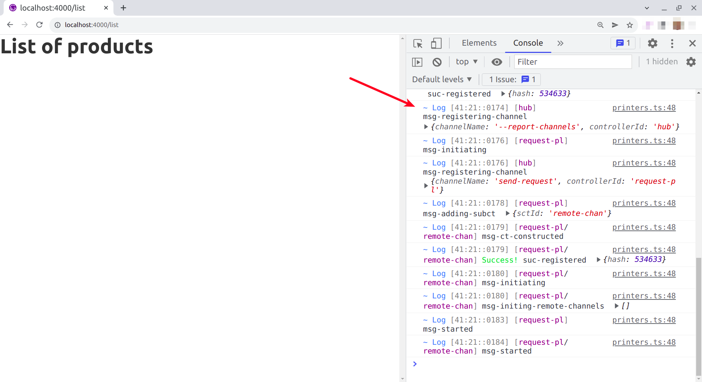
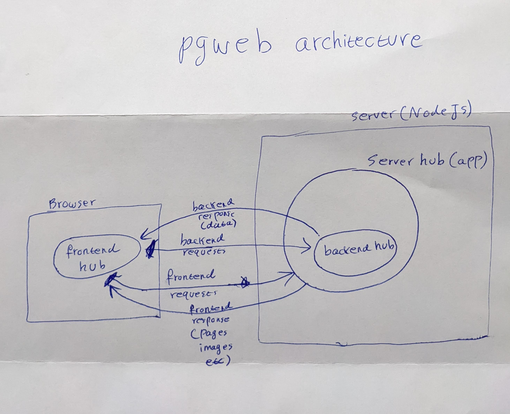

Understanding what we have done so far
----------------------------------------

Pgweb framework creates two hubs: one in frontend and one in the backend to form a full stack environment. The Pinglue `/server` route we used in the previous section to run the pgweb server creates a server to serve both backend and frontend requests. 

The `/server` app, during its initialization phase, creates the backend hub (on route `/backend`). So the backend hub lives inside the server app, and the server app directs all the backend requests (like those with url `/api/**`) to the backend hub. 


What about the frontend hub? If you ever noticed, after running the pgweb server, a new folder called `pg` is created within the `src` folder of the project folder. This folder is generated by the server app during its initialization and contains a group of generated javascript code to be used in the frontend app. Among the generated js files, the file `hun-factory.js` (as its name suggests) contains the code to bootstrap the frontend hub inside the browser. All you need to do is to import this file in your frontend app. That's all! For now, we are going to import this file in our list page:

*src/pages/list.js*
```diff-jsx
+   import "../pg/hub-factory";
    import * as React from "react";

    export default function() {

        return (
            <h1> List of products</h1> 
        );

    }
```
Once imported, `hub-factory.js` creates the frontend hub and make it globally accessible for your UI components. To see that the frontend hub is really created, run the pgweb server as described in the previous sections (along with Gatsby server of course). 

<Warn>Always run the pgweb server before running any frontend server. This is because the pgweb server generates some codes needed by the frontend project.
</Warn>

Then access the list page at `localhost:4000/list` and open the browser's developer tool console (hint: on Chrome press Ctrl+Shift+i). You should see color logs in the console:



These logs are generated by the frontend hub during its initialization phases (construction to start). This shows you got the third hub to work as well! Congratulations!

> **Note:** Compare these logs with the backend hub logs on the server side (printed on the screen) - They are same format and color, as they both generated by a Pinglue hub in two different environments: one in browser and one in NodeJS. These two hubs are in constant communication with other, and through this communication our full stack app will operate. 

So now you have all three hubs of the pgweb framework created and running in their right position. The summary of what explained in this page and what you created so far is the following diagram describing a high level view of the pgweb architecture:

