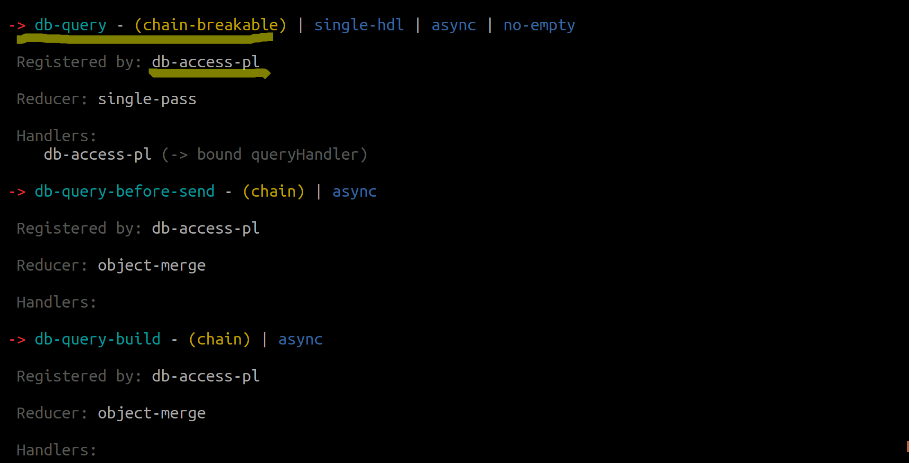
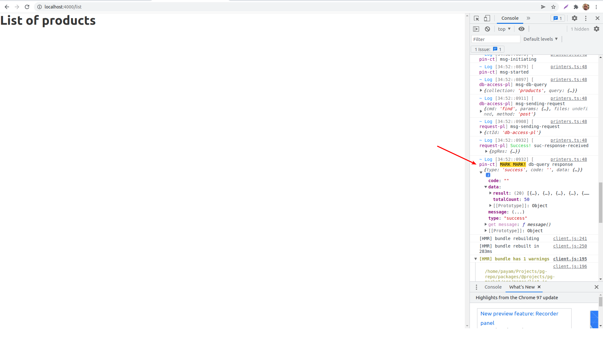

Installing db-access-pl
--------------------------

Now that we have the pgweb framework up and running, we can start installing plugins to add features and capabilities to our web app. Our goal for the list page is to show the list of products. So our first task would be to read from the database (MongoDB). 

*There is a plugin for that!* 

`db-access-pl` is a plugin for common read queries from the backend MongoDB. It somehow brings the db into your frontend (similar to what Firestore does) Lets install and use it then:

> **Wait:** Shutdown your servers first (both pgweb and your frontend servers)

*from the monorepo root*
```bash
npm run addto @pgweb/db-access-pl @pg-market/main
npm run bt
```

Validate that this plugin is indeed installed and recognized by the Pinglue system:

*from the project root*
```bash
npx pg info -k @pgweb/db-access-pl 
```

You should see some info for this package. If you see a message saying "no package found" then it is not installed properly :(

Channel "db-query"
------------------------
*db-access-pl* plugin creates a useful channel called *db-query* in the frontend hub which allows you to make mongodb-style queries right from the frontend components (e.g., a React component). 

> **Recall:** To see the definition of frontend channels for this package refer to the file `channels/frontend/info.yaml` in the package folder. To see a better presentation of this file, from the project root, run the command `npx pg channels-man frontend -k @pgweb/db-access-pl`

To make sure that this channel is registered and available in the frontend hub use the `pg channels` command which builds the hub and lists all the channels that are actually there:

```shell
npx pg channels frontend
```

You should see *db-query* channel in the list (along with the info that it is registered by *db-access-pl*)




Creating a React Pin & Querying the database
-----------------------------------------------

Now how to access *db-query* channel from a React component? In other words, how to convert a React component to a Pinglue Pin? The hook *usePin* does all that for us! It creates a Pinglue controller inside the React component and gives you all the familiar methods such as `runA`, `runS`, `log`, etc.

To begin with, lets create a new component at location `src/components/products-table` which renders a table containing our products. 

*src/components/products-table.js*
```jsx
import React, {useEffect} from "react";

import {usePin} from "@pgweb/react-utils";

export default function() {

    /* a Pinglue controller is created here and persists until the end of the component lifecycle. The hook returns methods, most of them having the same name and function as Pinglue controller's methods (and so their function should be self-explanatory). There a few exceptions: instead of method "glue" the hook returns "useGlue", which is a modified version of controller's re-modeled into React subscription mechanism. Another difference is a boolean state "isReady" which is set to true when the frontend hub is fully started and the in-residence controller of this Pin (and other controllers as well) are ready to operate. This state can be used to decide when this Pin component is ready to operate. 
    */   
    const {runA, isReady, log} = usePin();

    useEffect(()=>{

        if (!isReady) return;

        // in-resident controller is ready - the initialization code comes here

        // running the an async channel using the familiar runA method (the channel params/value should follow the channel description)
        runA("db-query", {
            collection: "products",
            query: {
                limit: 20
            }
        }).then(res => log.mark("db-query response", res));

    }, [isReady]);

    // While frontend hub is starting it is recommended not to render the Pin at all. Render it when the hub is ready and the Pin is connected to it.
    if (!isReady) return;

    return (
        <p></p>
    );
}
```

Include this component in your list page:

*src/pages/list.js*
```jsx
import "../pg/hub-factory";
import * as React from "react";

import ProductsTable from "../components/products-table";

export default function() {

    return (
        <>
            <h1> List of products</h1> 
            <ProductsTable/>
        </>
    );
}
```

Now start the servers (Gatsby as well as pgweb server) - navigate to url `localhost:4000/list` - In the developer console you should see the output of the `log.mark` (which is prefixed by a highlighted **MARK MARK** expression to make it more visible in the dev console):



Inspect the `res` object which is the response of the *db-query* channel. It's format is based on an interface called `Message` which is used a lot by both Pinglue and its plugins. This message type (hopefully) is `success`, and the field `data` contains the result of the database query: the total count and an array of items as we expected. Now it is up to you what to do with this data. In the following snippet, we just render this data into a basic table:

*src/components/products-table.js*
```jsx
import React, {useEffect, useState} from "react";

import {usePin} from "@pgweb/react-utils";

export default function ProductsTable() {

    const [products, setProducts] = useState([]);
    const {runA, isReady} = usePin();

    useEffect(()=>{

        if (!isReady) return;

        // in-resident controller is ready

        runA("db-query", {
            // collection name
            collection: "products",
            // mongodb query (customize by adding filter, limit, skip, etc, refer to Mongodb docs for more info)
            query: {
                limit: 20
            }
        }).then(res => {
            // if operation is successful
            if (res.type === "success")
                setProducts(res.data.result)
        });

    }, [isReady]);

    if (!isReady) return;

    return (       

        <table>
            <thead>
                <tr>
                    <th>Title</th>
                    <th>Type</th>
                    <th>Description</th>
                </tr>
            </thead>
            <tbody>
                {products.map(p=>(
                    <tr key={p._id}>
                        <td>{p.title} (Rating: {p.rating})</td>
                        <td>{p.type}</td>
                        <td>{p.description}</td>
                    </tr>
                ))}
            </tbody>
        </table>
    );
}
```

Now refresh the page, you should a table of the products!

At the end, to make our search table a bit more operational, lets add a search button which triggers the search and stop loading the search results upon load:

*src/components/products-table.js*
```jsx
import React, {useState} from "react";

import {usePin} from "@pgweb/react-utils";

export default function ProductsTable() {

    const [products, setProducts] = useState([]);
    const {runA, isReady} = usePin();

    const onSearch = async () => {
        if (!isReady) return;

        // in-resident controller is ready

        const res = await runA("db-query", {
            collection: "products",
            query: {
                limit: 20
            }
        });

        if (res.type === "success")
            setProducts(res.data.result);        
    }

    if (!isReady) return;

    return (
        
        <article>

            <section>
                <button onClick={onSearch}>
                    Search
                </button>
            </section>

            <table>
                <thead>
                    <tr>
                        <th>Title</th>
                        <th>Type</th>
                        <th>Description</th>
                    </tr>
                </thead>
                <tbody>
                    {products.map(p=>(
                        <tr key={p._id}>
                            <td>{p.title} (Rating: {p.rating})</td>
                            <td>{p.type}</td>
                            <td>{p.description}</td>
                        </tr>
                    ))}
                </tbody>
            </table>

        </article>
    );

}
```

Now you should be able to search after clicking on the search button.

commit: 18819b1f6dbfb94e1a9c1167abbd3960ce37b5e6