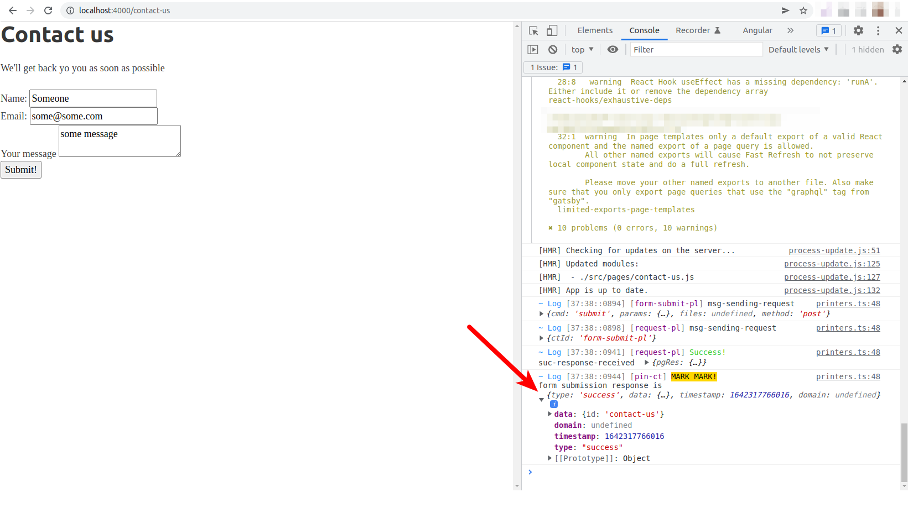
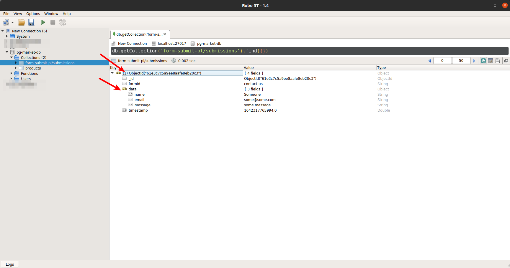

Now that you learned how to install the `db-access-pl` plugin and use it for database queries on the frontend probably you ask if there are more plugins for other purposes, the answer is yes! Pgweb ecosystem is meant to offer a large collection of useful plugins that enable you to do common tasks in a web app. All you need to do is to find the plugin that offers the feature you ant, install it, and then that's it; you will have some new channels (or have the existing channels enhanced) to do your feature. 

In this tutorial we cannot cover all those plugins, but just add a bit diversity, lets try another plugin: 

Plugin *form-submit-pl*
-------------------------
*form-submit-pl* is a simple plugin to handle all types of form submissions. It can be used for such forms as contact us, subscription, feedback, etc. Upon installation, this plugin adds some channels to the frontend (for a complete of list and description of channels refer to the package `channels/frontend/register.yaml` file). One channel that we are going to use is *submit-form*, and it should be almost clear what it does.

Once you collect the form data from the UI into an object `data`, all you have to do is to run this channel with your form id and the data:

```javascript
await runA({
    id: "contact-us",
    data
});
```

Here, form id is any arbitrary name that you give to your form. It is to separate different forms in the web app from each other. Note that you can submit to the same form id from different pages on your web app. All data submitted to the same form id will be stored together under that form id, and you can retrieve them later (will explain soon). 

Lets begin:

Adding form-submit-pl to the project
---------------------------------------

### Step 1:

Install *@pgweb/form-submit-pl* in the pg-market project:

*from the monorepo root*
```shell
npm run addto @pgweb/form-submit-pl @pg-market/main
npm run bt
```

Confirm that the package is installed successfully:

*from project main folder*
```shell
npx pg info -k @pgweb/form-submit-pl
```

You should see the package info.

Also confirm that the channel *submit-form* is present in the frontend hub:

```
npx pg channels frontend
```

You should see *submit-form* channel in the list.


### Step 2:

Now time to add a contact us from to our pg-market app.
Create a new page `src/pages/contact-us.js` with a basic contact-us form and collect the form data upon submission:

*src/pages/contact-us.js*
```jsx
import React, {useState} from "react";

export default function() {

    // form data
    const [name, setName] = useState("");
    const [email, setEmail] = useState("");
    const [message, setMessage] = useState("");

    // form submission
    const onSubmit = event => {        
        event.preventDefault();
        const data = {name, email, message};
        console.log("Form data is", data);
    }    

    return (

        <article>
            <h1>
                Contact us
            </h1>
            <p>
                We'll get back yo you as soon as possible
            </p>
            <form onSubmit={onSubmit}>
                <div>
                    <label> Name: </label>
                    <input 
                        name="name"
                        onChange={e=>setName(e.target.value)}
                    />
                </div>
                <div>
                    <label> Email: </label>
                    <input 
                        name="email"
                        onChange={e=>setEmail(e.target.value)}
                    />
                </div>
                <div>
                    <label> Your message </label>
                    <textarea 
                        name="message"
                        onChange={e=>setMessage(e.target.value)}
                    />
                </div>
                <div>
                    <input type="submit" value="Submit!"/>                       
                </div>
            </form>
        </article>
    );

}
```

Make sure the form works by running Gatsby server (no need to run pgweb server, just remember that Gatsby server is at *localhost:8000*)

### Step 3

Lets use the id *contact-us* for our contact us form. Use *usePin* hook to convert the component to a Pin and run the channel *submit-form* for submit the form:

*src/pages/contact-us.js*
```jsx
import "../pg/hub-factory";
import React, {useState} from "react";

import {usePin} from "@pgweb/react-utils";

export default function() {

    // form data
    const [name, setName] = useState("");
    const [email, setEmail] = useState("");
    const [message, setMessage] = useState("");

    // Pin materials
    const {runA, isReady, log} = usePin();

    // form submission
    const onSubmit = async event => {        
        event.preventDefault();
        const data = {name, email, message};
        
        // Running @submit-form channel 
        const res = await runA("submit-form", {
            id: "contact-us",
            data
        });
        log.mark("form submission response is", res);
    }  
    
    if (!isReady) return;

    return (

        <article>
            <h1>
                Contact us
            </h1>
            <p>
                We'll get back yo you as soon as possible
            </p>
            <form onSubmit={onSubmit}>
                <div>
                    <label> Name: </label>
                    <input 
                        name="name"
                        onChange={e=>setName(e.target.value)}
                    />
                </div>
                <div>
                    <label> Email: </label>
                    <input 
                        name="email"
                        onChange={e=>setEmail(e.target.value)}
                    />
                </div>
                <div>
                    <label> Your message </label>
                    <textarea 
                        name="message"
                        onChange={e=>setMessage(e.target.value)}
                    />
                </div>
                <div>
                    <input type="submit" value="Submit!"/>                       
                </div>
            </form>
        </article>
    );
}
```

### Step 4

Now run both pgweb and Gatsby servers. Access the page at `http://localhost:4000/contact-us` and fill the form with some data of your choice and submit it. Note that the above code logs the channel *submit-form*'s response, and the response should be a success message. 



### Step 5

Observe the submitted data in your Mongodb: you should see a new collection called *form-submit-pl/submissions* containing a document for your submitted form:



You can try submitting more forms and observe more documents added to this collection.

> **Note: ** There are additional ways to connect the form submission to user identity, such as requiring user to be logged in and/or including use identity in the submitted data, etc. For more info refer to the *form-submit-pl* docs.

Plugin isolation
----------------------

You might have noticed (and wondered) why the collection in which form-submit-pl stores the submitted form data is called *form-submit-pl/submissions* (and not just *submissions*)?

This is because pgweb (and basically any other pinglue based framework) tries to isolate and separate plugins as much as possible to minimize the danger of unwanted side effects. Please bear in mind the side effects are among the hardest bugs in software to recognize and fix. 

In a Pinglue base system we should try to limit the inter-plugin communication only to channels (which are well-monitored and documented) - any other form of communication, such as using global variables, using shared database records, could potentially lead to one plugin affects the work of another plugin in an unwanted way as the number of your plugin (and thus your system complexity) increases.

This isolation is a principal in Pinglue architecture by the name of *jailing*. 

Following this jailing principal, *pinglue/mongodb-pl* plugin, whose is in charge of managing Mongodb collection, will prefix the collection names by the requesting package id. 

So, for example, when the package *pgweb/form-submit-pl* with the package id *form-submit-pl* requests to access a collection by the name of *submissions* (through the channel *get-mongodb-collection* handled by plugin *pinglue/mongodb-pl*) the channel will actually create a Mongodb collection by the name of *form-submit-pl/submissions*. This prefixing guarantees that different plugins will not accidentally share the same collection (since package id is unique).

>**Exercise:** Try adding an order form to the pg-market so that the visitors can place order for your products. To make it more involve, you can use the @db-query channel to populate a dropdown select input for the form product choice.

commit: bf94e46536417b0abdde1156663e7e658ad618ae