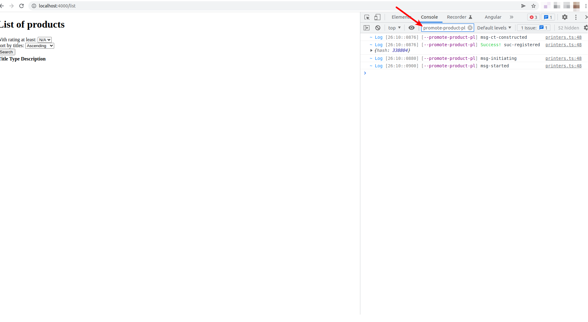

The deck of packages offered in pgweb library (and other third party collections) usually address general and common tasks on websites, such as database access, user authentication, session management, content delivery, etc. 

In previous sections we used *mongodb-pl* and *form-submit-pl* as an example of such general tasks. As long as you want some common feature there must be a plugin for that, and you can get it right out of box by installing the right package on your project.

But your website might have some custom logic that cannot be found in existing libraries (and in fact it should not be found since it is too custom to be published to a public repository)

For example suppose for our pg-market, the product manager asks us to add a (custom) promotion feature, where you can promote some products on the top of your list when users search for products. Lets assume the details of such promotion feature is too specific. 

In this situation, you have to *write your own Pinglue package*. It is the same as other Pinglue packages that you see in pgweb or @pinglue namespace, the only difference is, it is a private package for your own organization/project.

Welcome to Pinglue package development! In this section we will learn how to develop a Pinglue package for our pg-market project. This section is different from others, in that we are shifting from a being a "user" of Pinglue packages to being a "developer" of pinglue packages. This essentially requires us to learn more details of a Pinglue system and its inner coding parts.

Promotion feature
-------------------------
To keep things simple, we assume that the promotion feature that we are to implement is defined as follows:

The site admin has a list of *promoted* product titles (like Cherry, Fresh strawberry, etc) which is to be stored in the database. Now when the user performs a search in our *list* page, we want to re-order the results in the page and show the promoted products on the top (regardless of sorting input). The rest of the products come afterwards and should obey the sorting input (like ordered in ascending or descending order of their titles).

Extending channel *db-response-process* 
-------------------------------------------
The key to the feature above is extend the channel *db-response-process*. In the previous section we briefly introduced the workflow of channel *db-query*, and that *db-response-process* is one of the channels that run by *db-query* after the query response arrives from the server. 

This channel allows us to modify the query response. That's exactly what we want to do in our feature: we want to reorder the products array in the response and hoist the promoted items to the top of the list.

So we need to add a controller to the frontend hub that extends channel *db-response-process* to modify the db query response. To do so, we need to add a new plugin to our pg-market project.

Adding a new package
-----------------------
In Pinglue system we don't have a single monolithic codebase for the app. Instead, the app is composed of individual packages (which will be bootstrapped together into a hub by Pinglue hub factory). 

As a result, each feature you want to add to your project has to be in a package which will have its own codebase and repository (and even its own maintenance team). This makes the app more manageable.

Now for our new promotion feature explained above, lets create a new package called *pg-market/promote-product-pl*. We place this package folder beside the main project folder within the *@pg-market* folder:

*from `packages/@pg-market` folder:*
```shell
mkdir promote-product-pl
```

While there are automnatic tools and avaailable templates for quickly build a Pinglue package, in this tutorial we create a Pinglue package manually from sctratch in order to expose all the details under the hood. Alongside this, anotehr goal is to show the minimal Pinglue footprint on the regular npm package system. In fact Pinlue tries o be developer firnedly by adhering to the exisiting ecosystems and norms as much as possible, and avoid introducing weird departures. 

So here are the steps to create our new Pinglue package:

### Step 1: Create npm package

Pinglue package is pretty much a regular npm package, with an additional `pg.yaml` file at its package root which contain some additional Pinglue-related info. So the first step is to create an npm package inside our empty folder using the familiar `npm init` command:

*from `packages/@pg-market/promote-product-pl` folder:*
```shell
npm init
```

The above command will ask you some questions about the package you want to create. You can pick any answer, just for the package name (the first question) we use the name `@pg-market/promote-product-pl` in this tutorials. 

After answering all the questions, you should have a package.json file generated for you. If you just choose all the default values you should have something like:

```diff-javascript
{
  "name": "@pg-market/promote-product-pl",
  "version": "1.0.0",
  "description": "",
  "main": "index.js",
  "scripts": {
    "test": "echo \"Error: no test specified\" && exit 1"
  },
  "author": "",
  "license": "ISC"
}
```
Note that in this tutorial we use ES6 modules. So we need to add the module type to the package json to indicate it is an ES6 module and not commonjs:

```diff-javascript
{
  "name": "@pg-market/promote-product-pl",
  "version": "1.0.0",
  "description": "",
  +"type": "module", 
  "main": "index.js",
  "scripts": {
    "test": "echo \"Error: no test specified\" && exit 1"
  },
  "author": "",
  "license": "ISC"
}
```

<Tip>Make sure this package is recognized by your pinglue monorepo, by running the command `lerna list --all` (from anywhere in the monorepo). You should see the package *@pg-market/promote-product-pl* in the list.</Tip>

### Step 2: Adding pg.yaml file

The only thing that distinguishes an npm package from a Pinglue package is the config file *pg.yaml* at the package root.

Create a *pg.yaml* file at the root of *@pg-market/promote-product-pl* package folder with contents:

```yaml
id: --promote-product-pl  
```
The above is a minimal pg.yaml which specify the id to the package. This id is the only require field in pg.yaml and indicates the id of this package among all other packages that might be used with this package.

Recall that package id should be unique in the whole ecosystem. This requires us to come up with some naming conventions. As you notice we added a double dash to the beginning of the name. This is to indicate that this package is a *local* package, and to distinguish it from public packages such as those in @pinglue and @pgweb namespaces. 

<Note>
In general there are no hard and fast rule for naming package id, but the following are recommend best practices:

1. public and general purpose packages have their ids same as the package name minus the scope. e.g., `@pgweb/db-access-pl` -> `db-access-pl`

2. private and custom packages (which live in private repos for a particular project) have their ids same as the package name minus the scope prefixes with two double dashes., e.g., `@pg-market/promote-product-pl` -> `--promote-product-pl`

</Note>

### Step 3: Adding export routes

Each Pinglue package exports a subclass of *Controller* class in one or several routes. In pgweb we have two main routes:

1. `./frontend`: the controllers export to this route will be bootstrapped into the frontend hub.

2. `./backend`: the controllers export to this route will be bootstrapped into the backend hub.

<Note> There are several other routes in pgweb framework as well, but for now we focus on these two. </Note>

Your package can export controllers to one of some of these routes. For now we focus on the frontend hub. As the first step we want our package to add a controller to the frontend hun and extend channel *db-response-process*  as discussed above.

So add the following export route to the plugin package.json (*@pg-market/promote-product-pl/package.json*):

```diff-javascript
{
  "name": "@pg-market/promote-product-pl",
  "version": "1.0.0",
  "description": "",
  "type": "module", 
- "main": "index.js",
+ "exports": {
+     "./frontend": "./lib/frontend/index.js"
+ },
  "scripts": {
    "test": "echo \"Error: no test specified\" && exit 1"
  },
  "author": "",
  "license": "ISC"
}
```

<Tip>
    To learn more about routes in npm packages refer to [the official guide](https://nodejs.org/api/packages.html#subpath-exports)
</Tip>


### Step 5: Adding control for frontend hub

Now it is time to write code for the route `/frontend`, namely the file `./lib/frontend/index.js`. 

Note that this file refers to a javascript file. If you write your code in typescript (which we do in this tutorial) then your actual source code would be `./src/frontend/index.ts`, assuming that you use the typical config of compiling ts files in src folder into the lib folder. 

Another option is to write you code directly in javascript at `./lib/frontend/index.js` while we do not peruse in this tutorial. Instead we use typescript to write our package.

<Note> If you use a different setting for your typescript (i.e., a folder other than src and lib) then you will need to change the export route info accordingly. </Note>

But before writing code for `./src/frontend/index.ts`, recall that at minimum, to write a subclass of Controller we need to export the Controller class which is available in the pinglue package. So lets install the pinglue package from the monorepo to our package:

*from project root*
```shell
npm run addto pinglue @pg-market/promote-product-pl
npm run bt
```

Now you can copy/paste the minimal frontend controller template for your `./src/frontend/index.ts` file:

```typescript

import {Controller} from "pinglue/browser";

export default class extends Controller {

    async init() {

        // Glue some handler:
        // this.glue("channel-name", channelNameHandler.bind(this))

    }

    /*
    async channelNameHandler(params, value) {
        // Do something
    }*/

    async start() {

        // Run a channel:
        // await this.runA("channel-name", params, value)

    }
    
}
```

### Step: compile the typescript file

To compile the ts file we just created we need a `tsconfig` file in the package root in order to be able to compile this ts file. Create the following minimal tsconfig file which technically pulls in the base tsconfig at the monorepo root:

*@pg-market/promote-product-pl/tsconfig.json*
```json
{
    "extends": "../../../tsconfig.json",

    "compilerOptions": {
        "baseUrl": "./src",
        "outDir": "./lib",
        "rootDir": "./src"
    },

    "include": ["src/**/*.ts"],
    "exclude": ["src/**/_*.ts", "src/_**/*.ts"]
}
```
And of course you need to install the typescript itself in order to compile:

*from project root*
```shell
npm run addto typescript@4.3.5 @pg-market/promote-product-pl -- --dev
```

Now you can compile your ts file(s):

*from @pg-market/promote-product-pl*
```shell
npx tsc -b
```

Now you should see a *lib* folder in your package! 

### Step: Adding lib folder to gitignore (optional)

If you use git to store the source of this package, then the folder *lib* should not be included in the pushed files since it is a generated file. So create a `.gitignore` at the package root:

*@pg-market/promote-product-pl/.gitignore*
```
lib
```

Adding your package to pg-market project
-------------------------------------------

So far we have created an empty controller that is supposed to be bootstrapped in the frontend hub of the pg-market app. Lets see if this is the case or not.

Obviously you need to install your newly created package in the pg-market project:


*from the project root*
```
npm run addto @pg-market/promote-product-pl @pg-market/main
npm run bt
```
Double check if the new package is indeed installed on the pg-market project:

*from @pg-market main folder*
```
npx pg info -k @pg-market/promote-product-pl
```

You should see some info about the package, including :

1. its npm package name (@pg-market/promote-product-pl)
2. its pinglue id (--promote-product-pl)
3. Routes (`./frontend` at this moment)
4. Settings (which is mostly empty except for some system props)

You are done! Now start the pgweb server and the Gatsby server. Your frontend controller should be bootstrapped into the frontend!

To check this, access a page, like `localhost:4000/list`, and open the browser console. Pinglue controllers and hub produce a good number of logs by default. 

You can filter the logs using the id of your new package (--promote-product-pl). You should see some the logs produced by your new frontend controller. These logs are generated during the controller's life cycle from construction to start. 



If you such logs that means your controller is right there in the browser! 

In the next section we write more codes for this controller to make it operative.

